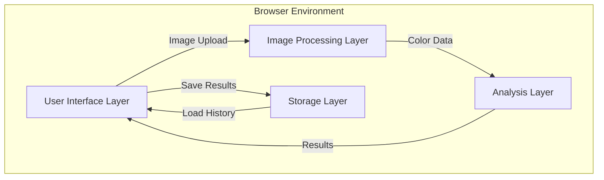
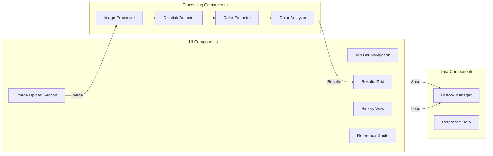

# Design Document: RenalX

## Overview

RenalX is a client-side web application that performs automated urinalysis dipstick analysis through image processing. The application follows a Material Design approach adapted for medical interfaces, emphasizing clarity, trustworthiness, and accessibility. All processing occurs locally in the browser to ensure data privacy.

The system architecture separates concerns into distinct layers:
- **Presentation Layer**: React-based UI components with Tailwind CSS styling
- **Image Processing Layer**: Computer vision algorithms for dipstick detection and color extraction
- **Analysis Layer**: Color-to-result mapping using calibrated reference data
- **Storage Layer**: Browser-based local storage for test history

## Architecture

### High-Level Architecture



### Component Architecture



## Components and Interfaces

### 1. Image Upload Component

**Responsibility**: Handle image capture and upload from users

**Interface**:
```typescript
interface ImageUploadProps {
  onImageSelected: (image: File | Blob) => void;
  maxFileSize: number; // in bytes
  acceptedFormats: string[]; // MIME types
}

interface ImageUploadState {
  previewUrl: string | null;
  isLoading: boolean;
  error: string | null;
}
```

**Key Methods**:
- `handleCameraCapture()`: Access device camera and capture image
- `handleFileUpload(file: File)`: Process uploaded image file
- `validateImage(file: File)`: Check file size and format
- `generatePreview(file: File)`: Create image preview URL

### 2. Image Processor

**Responsibility**: Orchestrate dipstick detection and color extraction

**Interface**:
```typescript
interface ImageProcessor {
  processImage(imageData: ImageData): Promise<ProcessingResult>;
}

interface ProcessingResult {
  success: boolean;
  dipstickDetected: boolean;
  colorPads: ColorPad[];
  error?: string;
}

interface ColorPad {
  parameter: ParameterType;
  position: Rectangle;
  colorValue: RGB;
}

type ParameterType = 'L' | 'N' | 'U' | 'P' | 'PH' | 'B' | 'S' | 'K' | 'Bi' | 'G';

interface RGB {
  r: number; // 0-255
  g: number; // 0-255
  b: number; // 0-255
}

interface Rectangle {
  x: number;
  y: number;
  width: number;
  height: number;
}
```

**Implementation Approach**:
- Use Canvas API to load and manipulate image data
- Resize large images to max 1920px width for performance
- Convert to appropriate color space for analysis

### 3. Dipstick Detector

**Responsibility**: Locate dipstick and identify color pad positions

**Interface**:
```typescript
interface DipstickDetector {
  detectDipstick(imageData: ImageData): DetectionResult;
}

interface DetectionResult {
  found: boolean;
  boundingBox: Rectangle;
  orientation: number; // rotation angle in degrees
  padPositions: Rectangle[]; // 10 positions for color pads
  confidence: number; // 0-1
}
```

**Detection Algorithm**:
1. Convert image to grayscale
2. Apply edge detection (Canny or Sobel)
3. Find rectangular contours matching dipstick aspect ratio (approximately 1:6)
4. Identify the largest qualifying contour as the dipstick
5. Divide dipstick region into 10 equal segments for color pads
6. Apply perspective correction if dipstick is rotated

### 4. Color Extractor

**Responsibility**: Extract representative color from each pad region

**Interface**:
```typescript
interface ColorExtractor {
  extractColors(imageData: ImageData, padPositions: Rectangle[]): RGB[];
}
```

**Extraction Algorithm**:
1. For each pad position, extract the pixel region
2. Remove outlier pixels (top/bottom 10% by brightness)
3. Calculate median RGB values from remaining pixels
4. Apply white balance correction using reference white area
5. Return array of RGB values corresponding to each parameter

### 5. Color Analyzer

**Responsibility**: Map extracted colors to parameter results

**Interface**:
```typescript
interface ColorAnalyzer {
  analyzeColors(colorPads: ColorPad[]): AnalysisResult;
}

interface AnalysisResult {
  timestamp: Date;
  parameters: ParameterResult[];
  overallStatus: 'normal' | 'abnormal';
}

interface ParameterResult {
  parameter: ParameterType;
  parameterName: string;
  value: string;
  level: ResultLevel;
  isNormal: boolean;
  normalRange: string;
  unit?: string;
}

type ResultLevel = 'negative' | 'trace' | '1+' | '2+' | '3+' | '4+' | 'specific_value';
```

**Color Mapping Approach**:
- Maintain reference color database for each parameter and result level
- Calculate color distance using Delta E (CIE76 or CIE2000)
- Select result level with minimum color distance
- Apply parameter-specific thresholds for classification

**Reference Color Database Structure**:
```typescript
interface ColorReference {
  parameter: ParameterType;
  resultLevel: string;
  referenceRGB: RGB;
  tolerance: number;
}
```

### 6. Results Display Component

**Responsibility**: Present analysis results in a clear, professional format

**Interface**:
```typescript
interface ResultsDisplayProps {
  result: AnalysisResult;
  onSave: () => void;
  onViewReference: (parameter: ParameterType) => void;
}
```

**Visual Design**:
- Grid layout with parameter cards (2 columns on desktop, 1 on mobile)
- Each card shows: parameter name, icon, value, normal range
- Color coding: green for normal, amber/red for abnormal
- Status icons: checkmark (normal), warning triangle (abnormal)
- Timestamp and confidence indicator at top
- Save to history button prominently displayed

### 7. History Manager

**Responsibility**: Persist and retrieve test history

**Interface**:
```typescript
interface HistoryManager {
  saveTest(result: AnalysisResult, imageData: string): Promise<void>;
  loadHistory(): Promise<TestHistoryEntry[]>;
  getTest(id: string): Promise<TestHistoryEntry | null>;
  deleteTest(id: string): Promise<void>;
  clearHistory(): Promise<void>;
}

interface TestHistoryEntry {
  id: string;
  timestamp: Date;
  result: AnalysisResult;
  thumbnailData: string; // base64 encoded thumbnail
  imageData?: string; // base64 encoded full image (optional)
}
```

**Storage Implementation**:
- Use IndexedDB for structured storage with better quota
- Fallback to localStorage if IndexedDB unavailable
- Store thumbnails (max 200px width) for history list
- Optionally store full images (compressed)
- Implement LRU eviction when storage quota exceeded

### 8. Reference Guide Component

**Responsibility**: Provide educational information about parameters

**Interface**:
```typescript
interface ReferenceGuideProps {
  selectedParameter?: ParameterType;
}

interface ParameterInfo {
  parameter: ParameterType;
  fullName: string;
  description: string;
  normalRange: string;
  clinicalSignificance: string[];
  abnormalCauses: string[];
}
```

**Content Structure**:
- Accordion or tab-based layout for 10 parameters
- Each parameter section includes:
  - Full name and abbreviation
  - What it measures
  - Normal range values
  - Clinical significance of abnormal results
  - Common causes of abnormalities
- Search/filter functionality for quick access

## Data Models

### Test Result Model

```typescript
interface TestResult {
  id: string;
  timestamp: Date;
  parameters: {
    leukocytes: ParameterResult;
    nitrites: ParameterResult;
    urobilinogen: ParameterResult;
    protein: ParameterResult;
    ph: ParameterResult;
    blood: ParameterResult;
    specificGravity: ParameterResult;
    ketones: ParameterResult;
    bilirubin: ParameterResult;
    glucose: ParameterResult;
  };
  overallStatus: 'normal' | 'abnormal';
  imageMetadata: {
    originalSize: number;
    dimensions: { width: number; height: number };
    captureMethod: 'camera' | 'upload';
  };
}
```

### Parameter Reference Data

```typescript
const PARAMETER_REFERENCES: Record<ParameterType, ParameterInfo> = {
  'L': {
    parameter: 'L',
    fullName: 'Leukocytes',
    description: 'White blood cells in urine',
    normalRange: 'Negative',
    clinicalSignificance: [
      'Indicates possible urinary tract infection',
      'May suggest kidney inflammation'
    ],
    abnormalCauses: [
      'Urinary tract infection',
      'Kidney infection',
      'Bladder infection'
    ]
  },
  // ... other parameters
};
```

### Color Reference Data

```typescript
const COLOR_REFERENCES: ColorReference[] = [
  {
    parameter: 'G',
    resultLevel: 'negative',
    referenceRGB: { r: 220, g: 230, b: 180 },
    tolerance: 25
  },
  {
    parameter: 'G',
    resultLevel: 'trace',
    referenceRGB: { r: 200, g: 210, b: 140 },
    tolerance: 25
  },
  {
    parameter: 'G',
    resultLevel: '1+',
    referenceRGB: { r: 180, g: 190, b: 100 },
    tolerance: 25
  },
  // ... more reference colors for all parameters and levels
];
```

## Correctness Properties

*A property is a characteristic or behavior that should hold true across all valid executions of a system—essentially, a formal statement about what the system should do. Properties serve as the bridge between human-readable specifications and machine-verifiable correctness guarantees.*
